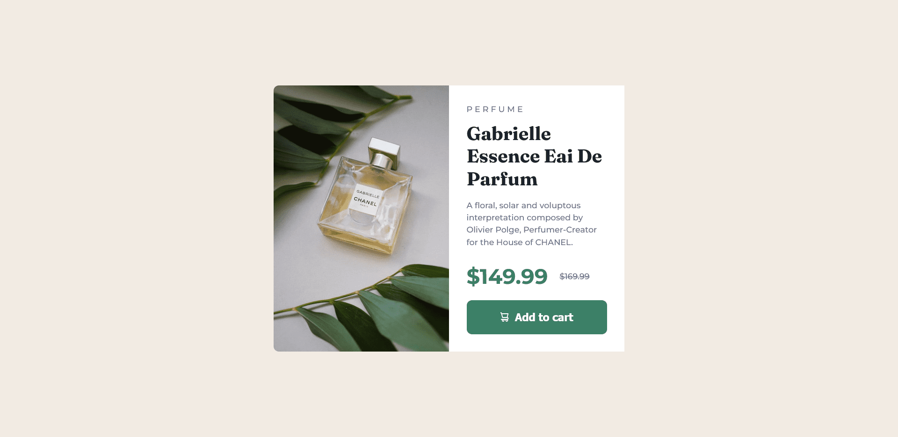

# Frontend Mentor - Product preview card component solution

This is a solution to the [Product preview card component challenge on Frontend Mentor](https://www.frontendmentor.io/challenges/product-preview-card-component-GO7UmttRfa). Frontend Mentor challenges help you improve your coding skills by building realistic projects. 

## Table of contents

- [Frontend Mentor - Product preview card component solution](#frontend-mentor---product-preview-card-component-solution)
  - [Table of contents](#table-of-contents)
  - [Overview](#overview)
    - [The challenge](#the-challenge)
    - [Screenshot](#screenshot)
    - [Links](#links)
  - [My process](#my-process)
    - [Built with](#built-with)
    - [What I learned](#what-i-learned)
    - [Continued development](#continued-development)
  - [Author](#author)

**Note: Delete this note and update the table of contents based on what sections you keep.**

## Overview

### The challenge

Users should be able to:

- View the optimal layout depending on their device's screen size
- See hover and focus states for interactive elements

### Screenshot



### Links

- Solution URL: [Code](https://github.com/Phurba-Sherpa/frontend-mentor--product-preview-component)
- Live Site URL: [Live](https://phurba-sherpa.github.io/frontend-mentor--product-preview-component/)

## My process

### Built with

- Semantic HTML5 markup
- CSS custom properties
- Flexbox
- CSS Grid
- Mobile-first workflow

### What I learned

Had small gap between content and image in mobile design, tried settin margin to 0, didn't work, what worked me was setting the img to display: block, removed the extra gap.
```html
<div class='product__card'>
  
  <div class='product-desc'></div>
</div>
```
```css
.prouduct__img {
  display: block;
}
```

I also learn that we can set different images based on the screen width, using `picture`. Thanks to the [Gautam Sarkar](https://www.frontendmentor.io/profile/gautam3333) for valuable concept.

```html
<picture>
  <source media="(min-width: 640px)" srcset='desktop-version.jpg" />
  
</picture>
```
So basically idea is that we can define different sources based on media query, and none matches the condition, image selection falls to the `img` that we defined at last. Its a default value just like in switch case. Also remember `sources` are optional but `img` is mandatory.

### Continued development

It's been about 6 months since I started focusing on css skill. In the upcomming days my focus remaings in following topics:
- Semantic html
- Responsive design with minimal css
- achieving design with minimal css 
- css animation
- BEM Methodology

## Author

- Website - [Phurba](https://phurbasherpa.name.np)
- Frontend Mentor - [Phurba](https://www.frontendmentor.io/profile/Phurba-Sherpa)
- LinedIn - [@phurbas](https://linkedin.com/in/phurbas)

